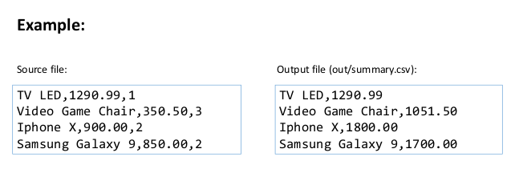
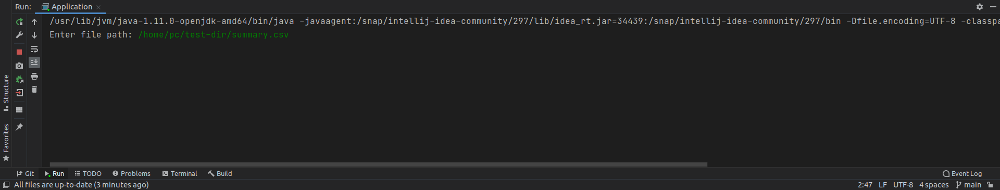
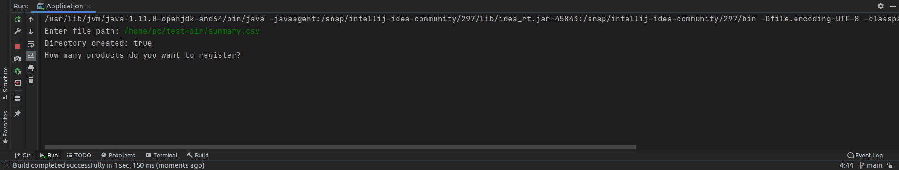
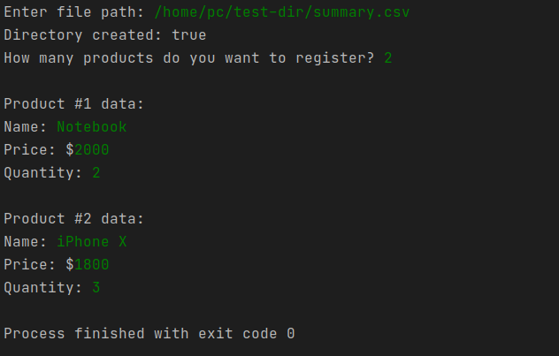
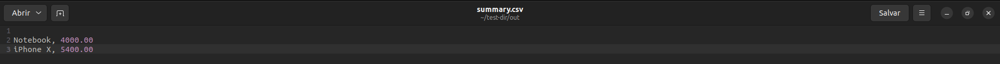

# Java File **(User-Focused Version)**

# Example

# Usage
**Enter the directory where the file will be created.**

**Enter the number of products you want to register.**

**After registering the products, a folder called "out" will be created inside the directory you specified with: Name, Product price x Quantity**

END. You can register as many products as you want, it will be well aligned. :)
